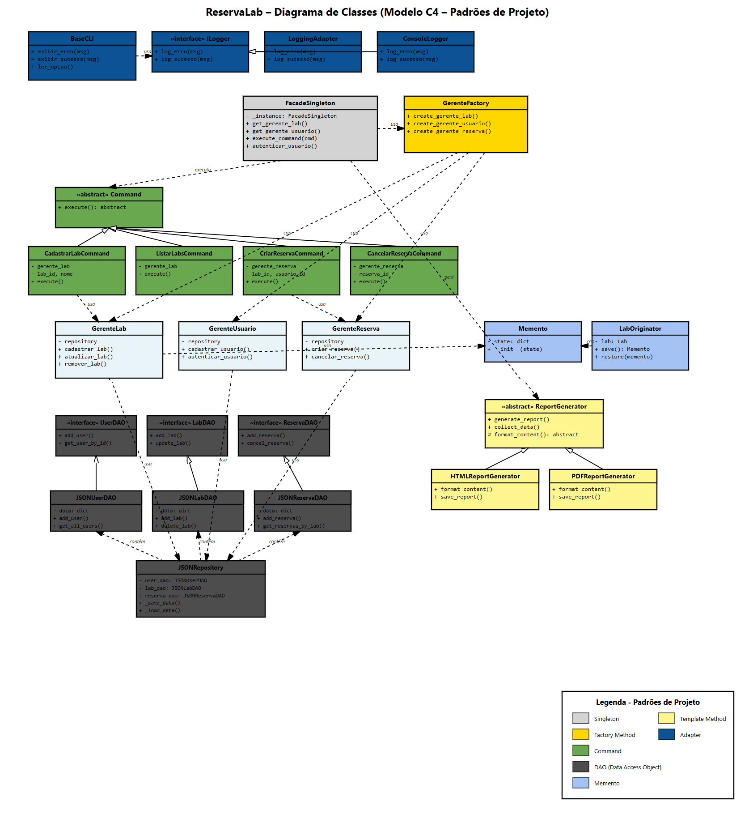

# 🏫 Sistema ReservaLab

Sistema completo de gerenciamento de laboratórios e reservas, desenvolvido com arquitetura em camadas e implementação de padrões de projeto GoF (Gang of Four).

## 📋 Índice

- [Visão Geral](#visão-geral)
- [Arquitetura](#arquitetura)
- [Padrões de Projeto](#padrões-de-projeto)
- [Estrutura do Projeto](#estrutura-do-projeto)
- [Instalação](#instalação)
- [Uso](#uso)
- [Funcionalidades](#funcionalidades)
- [Tecnologias](#tecnologias)
- [Contribuição](#contribuição)

---

## 🎯 Visão Geral

O **ReservaLab** é um sistema de gerenciamento de laboratórios universitários que permite:

- 👤 Gestão de usuários (administradores e usuários comuns)
- 🔬 Cadastro e controle de laboratórios
- 📅 Sistema de reservas com verificação de disponibilidade
- 📊 Geração de relatórios em múltiplos formatos (HTML, PDF)
- 🔐 Autenticação e controle de acesso
- 💾 Persistência de dados em JSON
- 📝 Sistema de logging avançado

---

## 🏗️ Arquitetura

### Diagrama de Classes (Modelo C4 - Nível 4)



*Diagrama completo mostrando todos os padrões de projeto implementados e suas inter-relações*

### Camadas da Arquitetura

O sistema é organizado em **5 camadas principais**:

#### 1️⃣ **Camada de Apresentação (CLI)**
- **BaseCLI**: Classe base com funcionalidades comuns para todas as interfaces
- **AdminCLI**: Interface para usuários administradores
- **UserCLI**: Interface para usuários comuns
- **LoginCLI**: Interface de autenticação

#### 2️⃣ **Camada de Controle (Controller)**
- **FacadeSingleton**: Ponto único de acesso ao sistema (Singleton)
- **GerenteFactory**: Fábrica para criação de gerentes (Factory Method)
- **GerenteLab**: Gerenciamento de laboratórios
- **GerenteUsuario**: Gerenciamento de usuários
- **GerenteReserva**: Gerenciamento de reservas
- **Commands**: Comandos para operações do sistema (Command Pattern)
- **ReportGenerator**: Geração de relatórios (Template Method)

#### 3️⃣ **Camada de Modelo (Entity)**
- **User**: Entidade de usuário (user_id, name, role, password)
- **Lab**: Entidade de laboratório (id, nome, capacidade, equipamentos)
- **Reserva**: Entidade de reserva (id, lab_id, usuario_id, data_inicio, data_fim, status, motivo)
- **Memento**: Estado salvável de laboratórios

#### 4️⃣ **Camada de Repositório (Repository)**
- **DAO Interfaces**: UserDAO, LabDAO, ReservaDAO
- **JSON Implementations**: JSONUserDAO, JSONLabDAO, JSONReservaDAO
- **JSONRepository**: Repositório principal com persistência JSON

#### 5️⃣ **Camada de Adaptadores (Adapters)**
- **ILogger**: Interface para logging
- **ConsoleLogger**: Implementação de log no console
- **LoggingAdapter**: Adaptador para biblioteca logging do Python

---

## 🎨 Padrões de Projeto

O sistema implementa **7 padrões de projeto GoF**:

### 1. **Singleton** 🔒
- **Classe**: `FacadeSingleton`
- **Propósito**: Garantir uma única instância da fachada do sistema
- **Benefício**: Centralização do acesso aos recursos do sistema

### 2. **Factory Method** 🏭
- **Classe**: `GerenteFactory`
- **Propósito**: Criação centralizada de objetos gerentes
- **Benefício**: Desacoplamento da lógica de criação de objetos

### 3. **Command** ⚡
- **Classes**: `Command` (abstrata) + subclasses específicas
  - `CadastrarLabCommand`
  - `ListarLabsCommand`
  - `CriarReservaCommand`
  - `CancelarReservaCommand`
  - E outras...
- **Propósito**: Encapsular operações como objetos
- **Benefício**: Facilita undo/redo, logging e transações

### 4. **DAO (Data Access Object)** 💾
- **Interfaces**: `UserDAO`, `LabDAO`, `ReservaDAO`
- **Implementações**: `JSONUserDAO`, `JSONLabDAO`, `JSONReservaDAO`
- **Propósito**: Abstrair acesso a dados
- **Benefício**: Facilita troca de fonte de dados (JSON → MongoDB, SQL, etc.)

### 5. **Memento** 💭
- **Classes**: `Memento`, `LabOriginator`
- **Propósito**: Salvar e restaurar estado de objetos
- **Benefício**: Implementação de funcionalidade de desfazer alterações em laboratórios

### 6. **Template Method** 📋
- **Classes**: `ReportGenerator`, `HTMLReportGenerator`, `PDFReportGenerator`
- **Propósito**: Definir esqueleto de algoritmo com variações nas subclasses
- **Benefício**: Reuso de código para geração de relatórios em diferentes formatos

### 7. **Adapter** 🔌
- **Classes**: `ILogger`, `LoggingAdapter`, `ConsoleLogger`
- **Propósito**: Adaptar interface da biblioteca logging para interface própria
- **Benefício**: Flexibilidade para trocar sistema de logging sem impactar código cliente

---

## 📁 Estrutura do Projeto

```
ReservaLab/
│
├── app/
│   └── main.py                      # Ponto de entrada da aplicação
│
├── cli/
│   ├── base_cli.py                  # Classe base CLI
│   ├── login_cli.py                 # Interface de login
│   ├── admin_cli.py                 # Interface do administrador
│   └── user_cli.py                  # Interface do usuário comum
│
├── controller/
│   ├── facade_singleton.py          # Singleton Facade
│   ├── gerente_factory.py           # Factory Method
│   ├── gerente_lab.py               # Gerente de Laboratórios
│   ├── gerente_usuario.py           # Gerente de Usuários
│   ├── gerente_reserva.py           # Gerente de Reservas
│   ├── report_generator.py          # Template Method para relatórios
│   └── commands/
│       └── command.py               # Command Pattern
│
├── entity/
│   ├── user.py                      # Entidade Usuário
│   ├── lab.py                       # Entidade Laboratório
│   ├── reserva.py                   # Entidade Reserva
│   └── memento.py                   # Memento Pattern
│
├── repository/
│   ├── dao.py                       # Interfaces DAO
│   └── json_repository.py           # Implementação JSON + DAOs
│
├── adapters/
│   ├── ilogger.py                   # Interface Logger
│   ├── console_logger.py            # Console Logger
│   └── logging_adapter.py           # Adapter para logging
│
├── reservalab_data.json             # Arquivo de dados (gerado automaticamente)
├── reservalab.log                   # Arquivo de log (gerado automaticamente)
├── relatorio_acesso.html            # Relatório HTML (gerado sob demanda)
└── README.md                        # Este arquivo
```

---

## 🚀 Instalação

### Pré-requisitos

- Python 3.8 ou superior
- pip (gerenciador de pacotes Python)

### Passos de Instalação

1. **Clone o repositório**
```bash
git clone https://github.com/seu-usuario/reservalab.git
cd reservalab
```

2. **Crie um ambiente virtual (opcional, mas recomendado)**
```bash
python -m venv venv
source venv/bin/activate  # Linux/Mac
# ou
venv\Scripts\activate  # Windows
```

3. **Instale as dependências**
```bash
pip install -r requirements.txt
```

---

## 💻 Uso

### Iniciar o Sistema

```bash
python app/main.py
```

### Login Padrão

**Usuário Administrador (criado automaticamente):**
- **ID**: `admin`
- **Senha**: `admin123`

### Fluxo de Uso

1. **Login** → Autentique-se com usuário e senha
2. **Menu Principal** → Escolha a operação desejada
3. **Operações**:
   - **Admin**: gerenciar labs, usuários, visualizar todas as reservas, gerar relatórios
   - **Usuário**: criar reservas, consultar disponibilidade, cancelar suas reservas

---

## ✨ Funcionalidades

### 👨‍💼 Funcionalidades do Administrador

- ✅ Cadastrar, atualizar e remover laboratórios
- ✅ Listar todos os laboratórios
- ✅ Cadastrar novos usuários (admin ou comum)
- ✅ Listar todos os usuários do sistema
- ✅ Visualizar todas as reservas
- ✅ Gerar relatórios de acesso (HTML/PDF)
- ✅ Desfazer última atualização de laboratório (Memento)

### 👤 Funcionalidades do Usuário Comum

- ✅ Visualizar laboratórios disponíveis
- ✅ Criar reservas de laboratórios
- ✅ Consultar disponibilidade de laboratórios
- ✅ Visualizar suas próprias reservas
- ✅ Cancelar suas reservas

### 🔧 Funcionalidades Técnicas

- ✅ Validação de conflitos de horário
- ✅ Validação de capacidade de laboratórios
- ✅ Verificação de permissões por role
- ✅ Persistência automática em JSON
- ✅ Logging dual (console + arquivo)
- ✅ Sistema de undo para operações críticas
- ✅ Geração de relatórios estatísticos

---

## 🛠️ Tecnologias

- **Linguagem**: Python 3.8+
- **Persistência**: JSON (arquivo local)
- **Arquitetura**: Camadas + Padrões GoF
- **Interface**: CLI (Command Line Interface)
- **Logging**: Python logging module + console
- **Formato de dados**: JSON, HTML, PDF (texto)

### Bibliotecas Utilizadas

- `json`: Manipulação de dados JSON
- `datetime`: Gerenciamento de datas e horários
- `logging`: Sistema de logging
- `os`: Operações de sistema de arquivos
- `abc`: Classes abstratas

---
