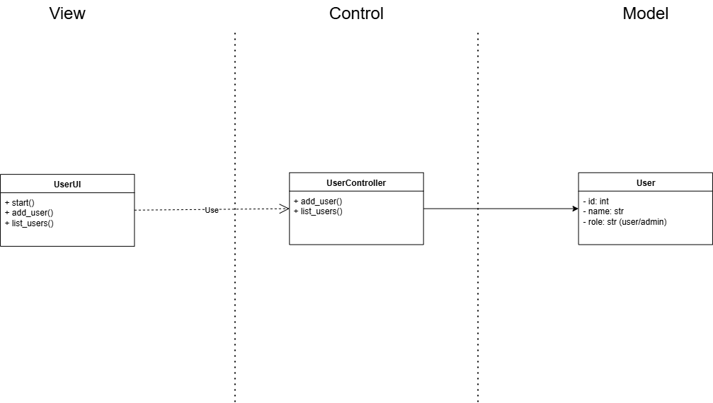

# Sistema de Gerenciamento de Usuários ReservaLab

Um sistema simples de gerenciamento de usuários demonstrando arquitetura em camadas com interfaces console e web.

## Arquitetura

### Arquitetura de Alto Nível


O sistema segue um padrão simples em camadas:
- **UserUI**: Gerencia interação e exibição do usuário
- **UserController**: Contém lógica de negócio e validação
- **User**: Representa o modelo de dados do usuário

### Arquitetura Detalhada


O sistema é organizado em quatro camadas:

#### 1. Camada de Visualização
- **UserUI**: Interface console (`user_ui.py`)
- **UserUIStreamlit**: Interface web (`user_ui_streamlit.py`)

#### 2. Camada de Controle
- **UserController**: Lógica de negócio, validação, operações de usuário

#### 3. Camada de Modelo
- **User**: Entidade usuário com user_id, name, role, password

#### 4. Camada de Infraestrutura
- **UserRepository**: Interface de armazenamento em memória
- **MongoUserRepository**: Armazenamento persistente MongoDB

## Início Rápido

### Versão Console
```bash
cd ReservaLab
python app/main.py
```

### Versão Web (Streamlit)
```bash
cd ReservaLab
pip install -r requirements.txt
streamlit run streamlit_app.py
```

## Funcionalidades
- Adicionar usuários com validação
- Listar todos os usuários
- Validação de força da senha
- Validação de ID do usuário (máx 12 chars, sem números)
- Suporte para armazenamento em memória e MongoDB
